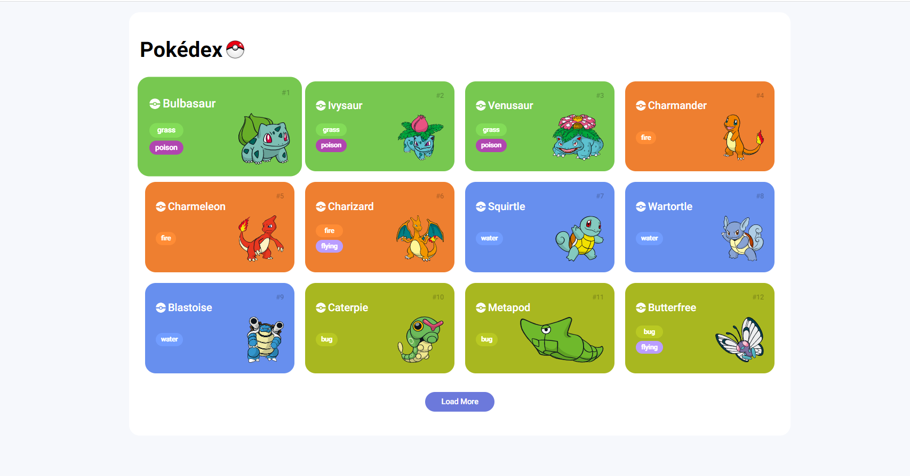

# Pokédex com Javascript 

- Projeto desenvolvido nas aulas de Javascript do Bootcamp Orange Tech + da DIO.

- O mesmo utiliza a [PokeApi](https://pokeapi.co/) para o consumo das informações.

 

## Tecnologias 🛠

- Javascript
- HTML
- CSS

